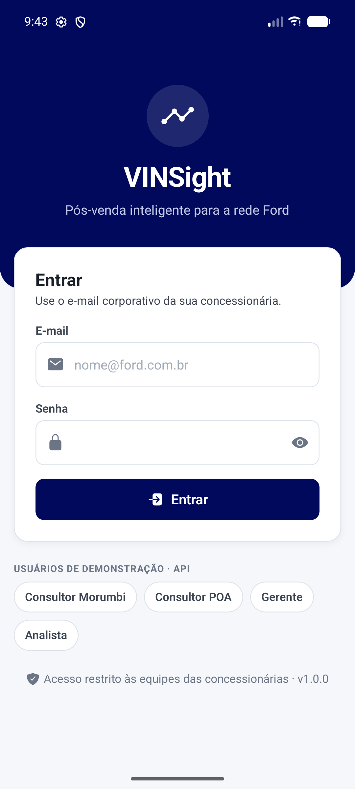
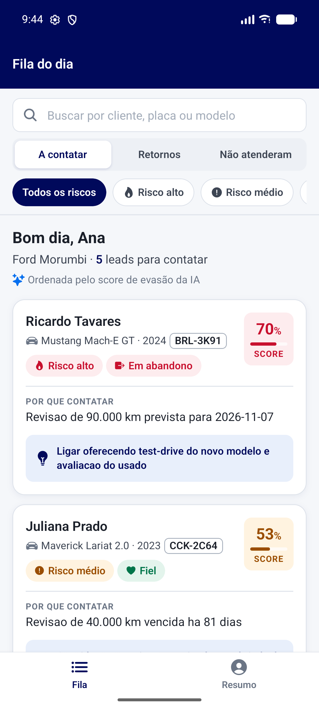
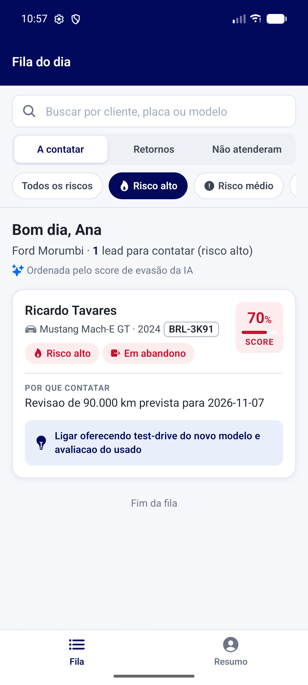
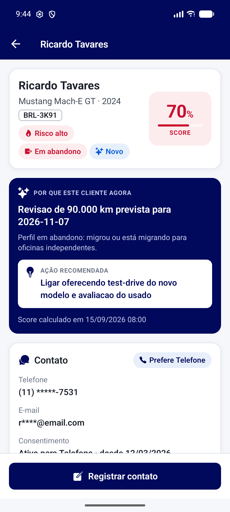
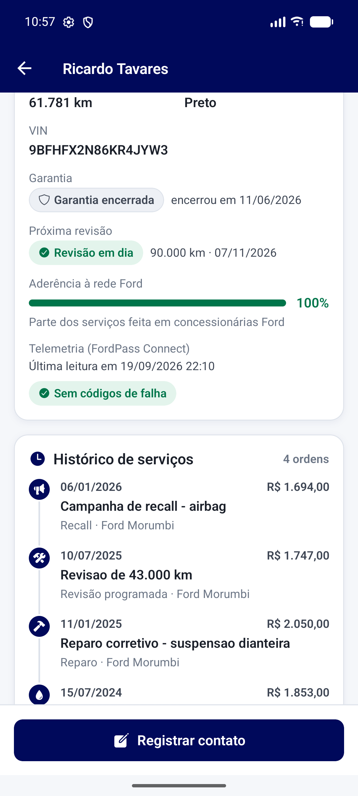
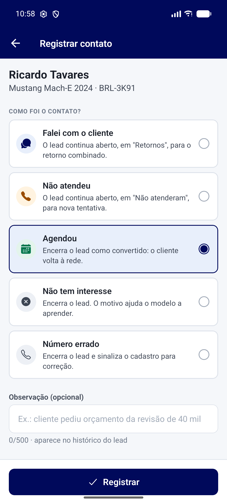
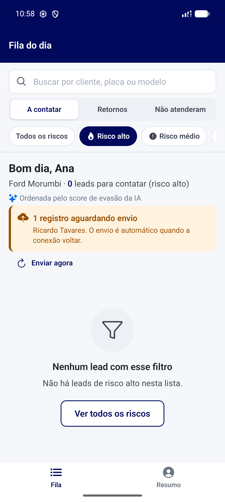
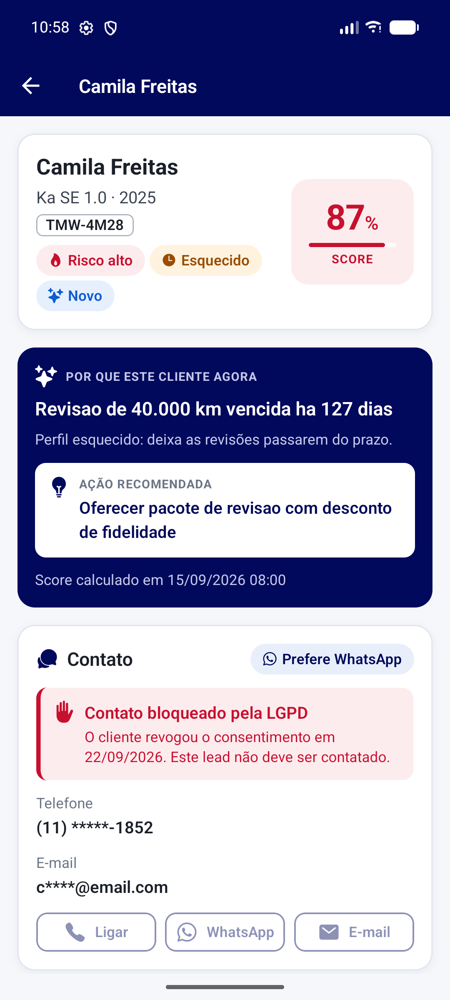
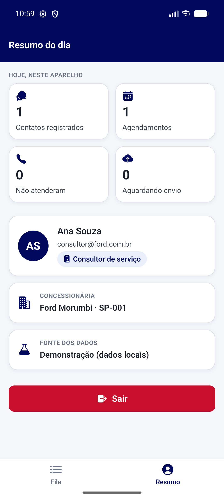

# VINSight Ford — app do consultor de serviço

**Challenge FIAP 2026 · Ford Motor Company · Desafio 02 — Impulsionando o VIN Share na América do Sul**

Grupo 02:

- Glauco Heitor Gonçalves — RM 555978
- Pedro Henrique Junqueira — RM 556278

App **React Native + Expo** do **consultor de serviço da concessionária Ford**. O consultor abre o app e
recebe a **fila de clientes com maior risco de sair da rede oficial**, priorizada pelo score de churn do
modelo de IA. Ele vê o contexto completo do cliente e do veículo antes de ligar e registra o resultado de
cada contato, que realimenta o modelo.

> *Dado bruto → score de churn → fila priorizada → app do consultor → registro de desfecho → realimentação do modelo.*

## 🎬 Vídeo demonstrativo

[](https://youtu.be/dxPR_EM54N8)

> Clique na imagem para assistir no YouTube.


## Download do APK

**[Baixar o APK (Releases)](https://github.com/Challenge-2026-VinsightFord/mobile_fiap/releases/latest)**

| Arquivo | Para quê |
|---|---|
| `vinsight-demo.apk` | **Avaliação.** Roda em qualquer Android, sem servidor: usa os dados de demonstração embutidos (respostas reais da API) |
| `vinsight-api.apk` | Conectado à [vinsight-api](https://github.com/glaucoheitor21/vinsight-api). No emulador do Android Studio encontra a API do PC sozinho (`10.0.2.2:8080`) |

> **Para avaliar, use o `vinsight-demo.apk`.** A API e o banco MySQL rodam localmente (não estão hospedados),
> então o APK conectado só funciona com a API no ar no mesmo PC (emulador) ou na mesma rede. Para rodar o
> conjunto completo, siga [Como rodar com a API](#como-rodar-com-a-api-completo).

Nos dois, a tela de login tem atalhos para os usuários de demonstração:

| E-mail | Senha | Perfil |
|---|---|---|
| `consultor@ford.com.br` | `consultor123` | Consultor · Ford Morumbi (fluxo principal) |
| `consultor.poa@ford.com.br` | `consultor123` | Consultor · Ford Porto Alegre (outra unidade: 403 nos leads de Morumbi) |
| `gerente@ford.com.br` | `gerente123` | Gerente (vê o telefone completo e liga pelo app) |
| `analista@ford.com.br` | `analista123` | Analista Ford (o app recusa: esse perfil usa o dashboard web) |

## Telas

| Login | Fila do dia | Filtro e busca |
|---|---|---|
|  |  |  |

| Detalhe do lead (visão 360°) | Veículo e histórico | Registro de desfecho |
|---|---|---|
|  |  |  |

| Envio pendente (sem conexão) | Contato bloqueado por LGPD | Resumo do dia |
|---|---|---|
|  |  |  |

## Funcionalidades

| História | O que o app faz |
|---|---|
| **US-44** Base e design system | Tema central em `src/theme` (paleta Ford, tipografia, espaçamentos, raios, sombras) e componentes reutilizáveis em `src/components`. Nenhuma tela usa cor ou tamanho solto |
| **US-45** Login seguro | Validação de campos, erro de credencial com a senha limpa, tokens no **Expo SecureStore** (nunca no AsyncStorage), renovação automática pelo refresh token e aviso de sessão encerrada |
| **US-46** Fila de leads | Ordem por score, filtro por faixa de risco, abas por status, busca por nome ou placa, pull-to-refresh e rolagem infinita |
| **US-47** Visão 360° | Veículo, garantia, próxima revisão, telemetria com códigos de falha, aderência à rede, histórico em linha do tempo, perfil comportamental e **o score com o motivo da priorização**. Botões de contato respeitam o canal preferido e o consentimento (LGPD) |
| **US-48** Desfecho | Contatado, agendado, sem sucesso, recusado ou número inválido, com observação e data de retorno. **Sem conexão, o registro fica pendente e é reenviado sozinho**, com `Idempotency-Key` para não duplicar no servidor |
| **US-49** APK | Build de release com ícone, splash e versão próprios |

Toda tela tem os estados de **carregando, vazio, erro de rede e sem permissão**.

## Arquitetura

```
app/                     Rotas (expo-router): login, abas, detalhe e desfecho
  (tabs)/                Fila do dia e Resumo do dia
  lead/[id].tsx          Detalhe do lead (visão 360°)
  desfecho/[id].tsx      Registro de desfecho
src/
  api/                   Única camada que fala com a rede
    config.ts            Base URL e flags (USE_MOCK, ATALHOS_DEMO)
    http.ts              Cliente HTTP: token, refresh, erros RFC 7807, correlation id
    servicos.ts          Endpoints da vinsight-api
    mock/                Servidor falso com respostas reais da API (modo demonstração)
  sessao/                Sessão do usuário (SecureStore)
  sincronizacao/         Fila de registros pendentes e reenvio idempotente
  components/            Biblioteca de componentes do design system
  theme/                 Cores, tipografia, espaçamento
  dominio/               Regras de apresentação, formatos e validação
```

Nenhuma tela chama `fetch`: tudo passa por `src/api`. Com `EXPO_PUBLIC_USE_MOCK=true` a mesma camada
responde com os JSONs de `src/api/mock/dados` (gerados da API real por `npm run gerar-mocks`), então o
app é demonstrável sem backend.

## Como rodar em desenvolvimento

Requisitos: Node.js 22 LTS (ou 24) e o **Expo Go** (SDK 56) no celular ou no emulador.

```bash
npm install
npx expo start
```

Leia o QR code com o Expo Go, ou aperte `a` com o emulador aberto. O app procura a API no mesmo PC que
roda o Metro, sem configurar nada. Para usar sem a API, crie um `.env.local` com `EXPO_PUBLIC_USE_MOCK=true`.

## Como rodar com a API (completo)

1. **MySQL 8** instalado e rodando (usuário e senha padrão da API: `root` / `fiap`).
2. **API:** clone a [vinsight-api](https://github.com/Challenge-2026-VinsightFord/vinsight-api) e rode `mvnw.cmd spring-boot:run`
   (JDK 21). O banco `vinsight` e os dados de demonstração são criados sozinhos. Teste em
   <http://localhost:8080/actuator/health>.
3. **App:** `npx expo start` neste repositório (acha a API sozinho), ou instale o `vinsight-api.apk` no
   emulador do Android Studio.

Registrar desfechos altera o banco. Para voltar ao estado inicial: `DROP DATABASE vinsight;` e reinicie a API.

Guia completo (firewall, emulador, celular, gravação): [`docs/GUIA_AMBIENTE.md`](docs/GUIA_AMBIENTE.md).

## Como gerar o APK

**Pela nuvem da Expo (EAS Build):**

```bash
npx eas-cli login
npx eas-cli build -p android --profile entrega
```

O perfil `entrega` gera o APK de demonstração, e o perfil `api` gera o APK conectado (ver `eas.json`).

**Localmente, com o Android SDK do Android Studio** (foi assim que os APKs da entrega foram gerados):

```bash
npx expo prebuild -p android
cd android
./gradlew assembleRelease -PreactNativeArchitectures=x86_64,arm64-v8a -x lintVitalAnalyzeRelease
```

O `JAVA_HOME` precisa apontar para um JDK 17 a 21 (o do Android Studio serve:
`C:\Program Files\Android\Android Studio\jbr`). As variáveis `EXPO_PUBLIC_*` do ambiente entram no APK. O
arquivo sai em `android/app/build/outputs/apk/release/app-release.apk`. O `-x lintVitalAnalyzeRelease` pula o lint
do release, que trava num bug interno ao analisar `react-native-screens` e `react-native-worklets`.

**Ao trocar as variáveis entre um APK e outro**, apague `android/app/build/generated/assets` antes: o Gradle
não percebe a mudança e reaproveita o JavaScript do build anterior.

Ícones e splash são gerados por `scripts/gerar-icones.ps1`.

## Tecnologias

React Native 0.85 · Expo SDK 56 · expo-router · TypeScript · Expo SecureStore · expo-crypto ·
NetInfo · AsyncStorage (só contadores) · API REST Java/Spring Boot ([vinsight-api](https://github.com/glaucoheitor21/vinsight-api))
